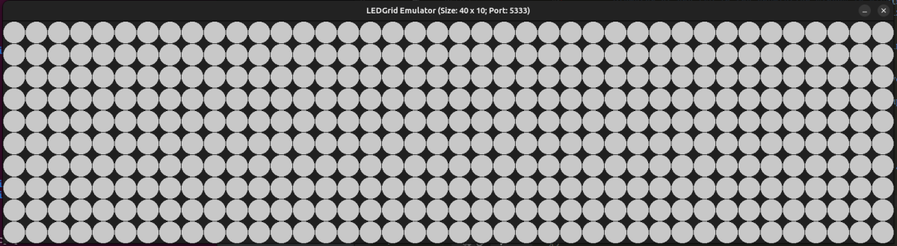
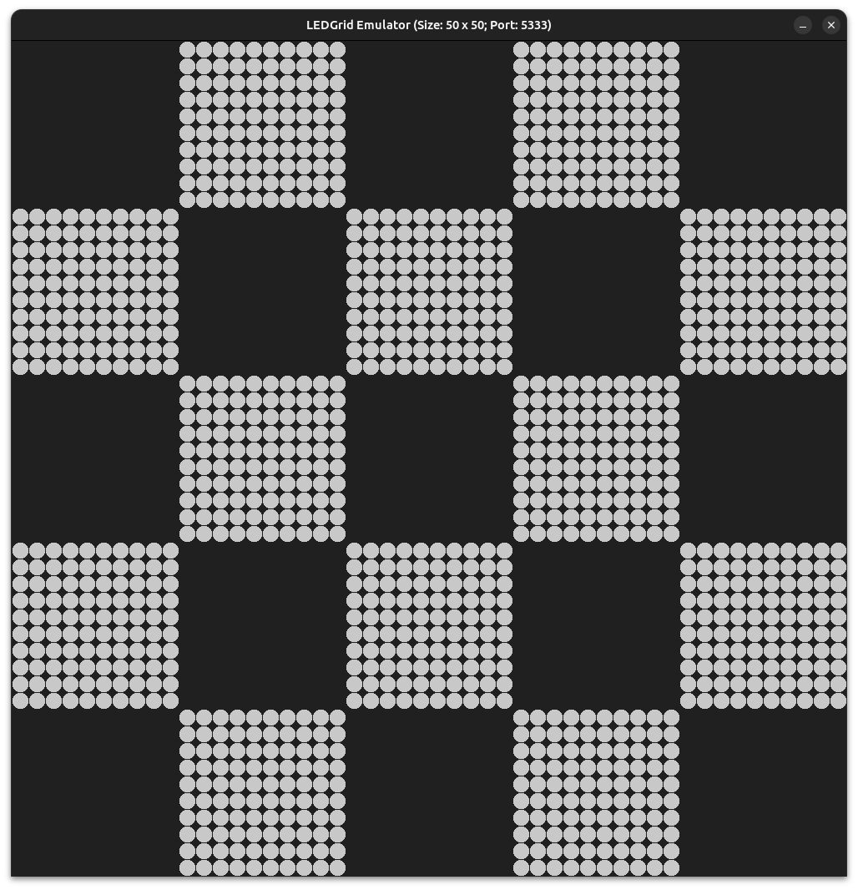

# gridEmulator

With gridEmulator you can emulate arbitrary compositions of NeoPixel-Panels
as described in the conf directory.

Usage:

    gridEmulator [flag]

Supported flags are:

    -width=40
        Width of the grid in number of LEDs. This must be a multiple of 10.
    -height=10
        Height of the grid in number of LEDs. This must be a multiple of 10!
    -custom=""
        Use the panel configuration with the specified name instead of the
        default configuration. The configuration file must be placed in the
        conf/data directory and has suffix .json
    -size=40.0
        Diameter of one LED in the enumlation window in pixels. With a smaller
        number, even large grids fit onto your screen. The size of the
        emulator window is fixed.
    -data=5333
        Specify the UDP port where the emulator listens for incoming data
        packages.
    -rpc=5332
        Specifiy the TCP port, where RPC calls will be received
    -cpuprof
        Write cpu profiling data in the file gridEmulator.cpuprof
    -memprof
        Write memory profile data to gridEmulator.memprof
    -trace
        Write trace data to gridEmulator.trace

Without any flags, a 40x10 grid will be created with LEDs of 40 pixel in
diameter. This will look like in the picture below:



With the help of the custom configuration file `chessBoard.json`, containing
the following panel configuration:

```
[
    {"Col": 1, "Row": 0, "Mod": "RL:180"},
    {"Col": 2, "Row": 1, "Mod": "LR:0"  },
    {"Col": 3, "Row": 0, "Mod": "RL:180"},
    {"Col": 4, "Row": 1, "Mod": "RL:90" },
    {"Col": 3, "Row": 2, "Mod": "LR:270"},
    {"Col": 4, "Row": 3, "Mod": "RL:90" },
    {"Col": 3, "Row": 4, "Mod": "RL:0"  },
    {"Col": 2, "Row": 3, "Mod": "LR:180"},
    {"Col": 1, "Row": 4, "Mod": "RL:0"  },
    {"Col": 0, "Row": 3, "Mod": "RL:270"},
    {"Col": 1, "Row": 2, "Mod": "LR:90" },
    {"Col": 0, "Row": 1, "Mod": "RL:270"}
]
```
and a smaller size of the circles for the LEDs, you the the following output:
```
./gridEmulator -custom chessBoard -size 20
```


