# The layout of your LEDGrid

## Modules

The hardware I use for my projects is based on chains of WS2801 NeoPixels.
You can buy them in strands of 25 or 50 pixels. A chain with 100 pixels,
organized in a square of 10 by 10 pixels is the smallest building block, I
call it a _module_. In the picture below, you'll see how the 100 pixels are
organized in such a module.

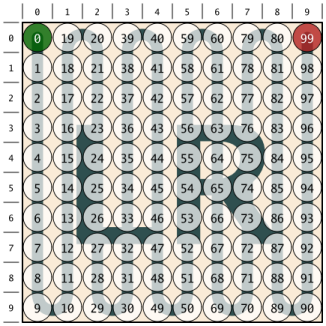

This particular module is called **LR:000** (more on this name later).

Each circle stands for one pixel (i.e. LED). The numbers in the circles as
well as the big gray strand in the background show the direction of the chain.
The green circle denotes the first pixel of the module whereas the red circle
denotes the last pixel of the module. Because the chain starts on the left
side of the module and ends on the right side, this type of module is called
**LR** (left-to-right).

The mirrored twin of a **LR** module is (of course) a **RL** module (shown in
the picture below):

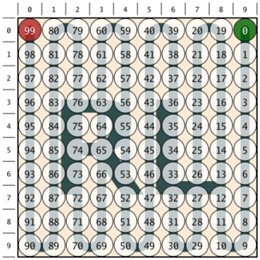

Each of the two modules can be turned by 0, 90, 180 or 270 degrees, which
gives a total of 8 modules

| LR:000 | LR:090 | LR:180 | LR:270 |
|--------|--------|--------|--------|
||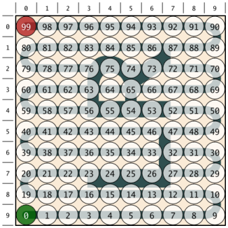|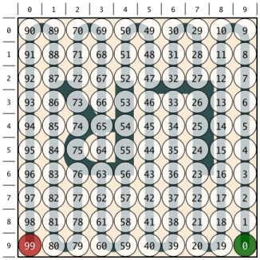|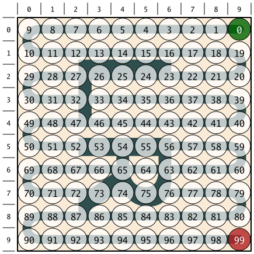|

| RL:000 | RL:090 | RL:180 | RL:270 |
|--------|--------|--------|--------|
||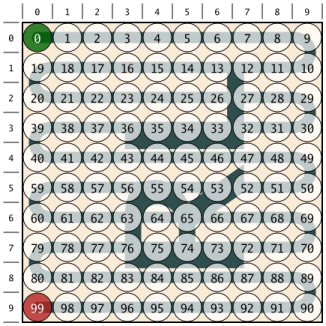|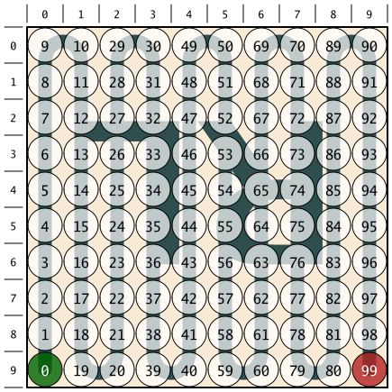|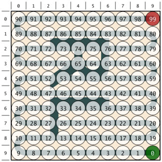|

## Chaining the modules

With this set of 8 modules you can start and build your LED-wall. There is no
limit in size and you dont't have to place the modules seamingless - as long
as you respect the following _golden rule_:

> The red end circle of one module must be in the same corner as the green
> start circle of the following module.

400 pixels, mounted on 4 modules can be arranged in the following orders.
For each example, the content of it's configuration file is also shown.
The syntax of the configuration files will be explained right afterwards.

### Adjacent

The simplest configuration: just one module after the other.

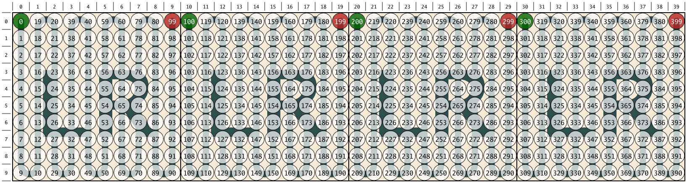

    [
        {"Col": 0, "Row": 0, "Mod": "LR:0"  },
        {"Col": 1, "Row": 0, "Mod": "LR:0"  },
        {"Col": 2, "Row": 0, "Mod": "LR:0"  },
        {"Col": 3, "Row": 0, "Mod": "LR:0"  }
    ]

### Even-Odd

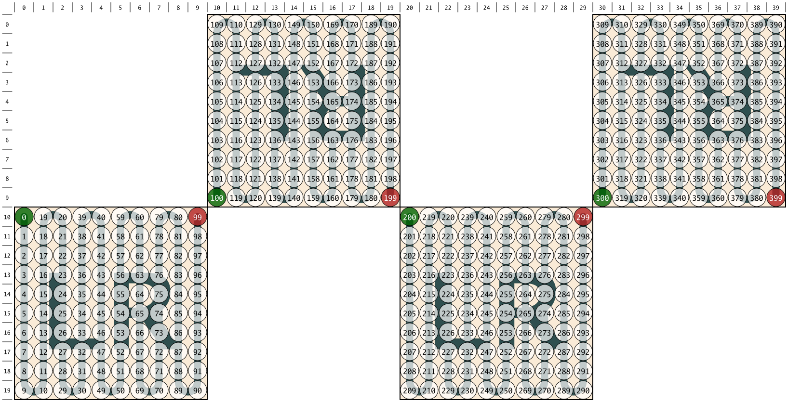

### Odd-Even

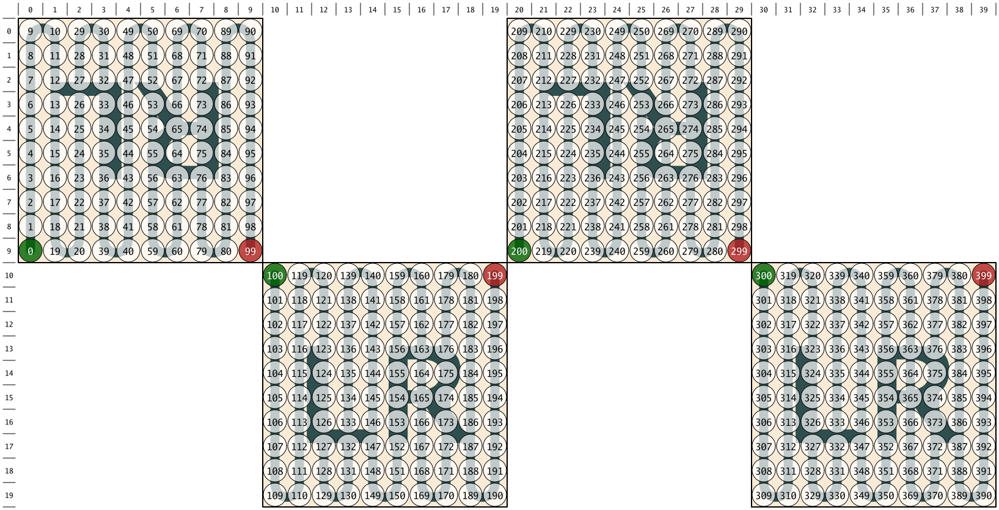

### A Hole

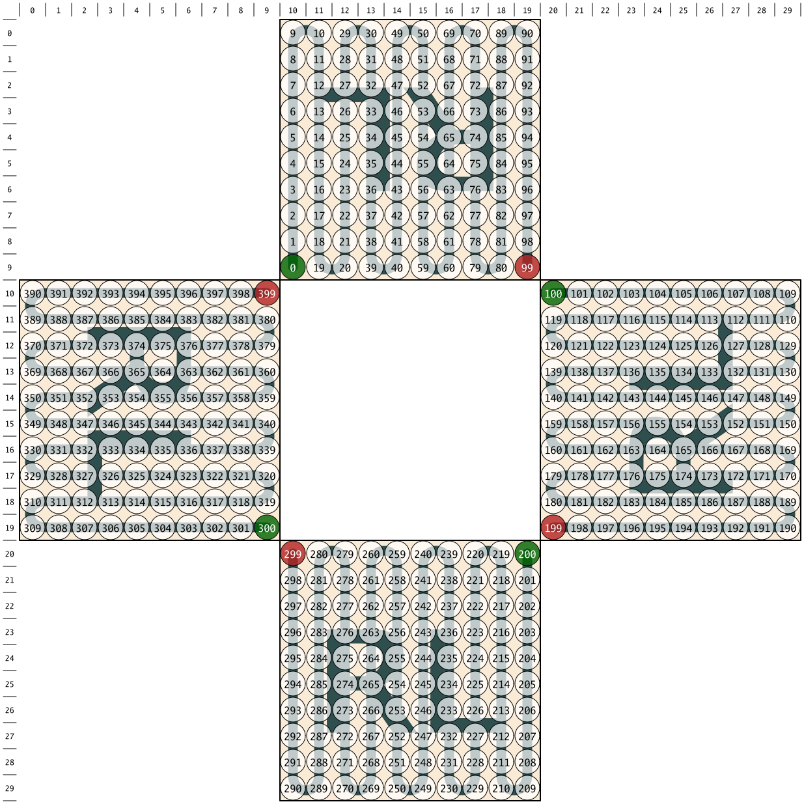
